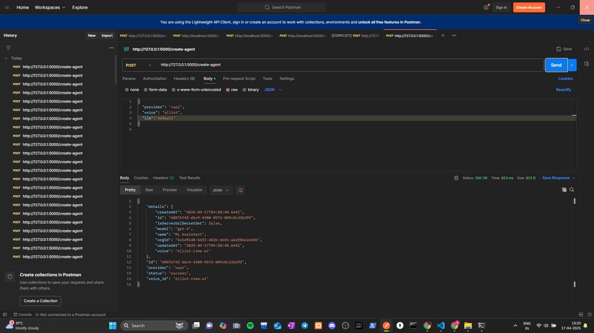

# 🤖 Vapi Assistant Creator API

This project provides a simple Flask-based REST API for creating AI assistants using **Vapi** and **Retell** providers. It integrates both platforms to enable dynamic assistant generation with a single API endpoint.




---

## 🚀 Features

- Create agents dynamically using **Retell** or **Vapi**.
- Unified POST endpoint `/create-agent`.
- Returns relevant agent or assistant IDs.
- Simple, clean JSON-based interface.
- Ready for Postman testing.

---

## 📦 Requirements

Install required Python packages with:

```bash
pip install -r requirements.txt
